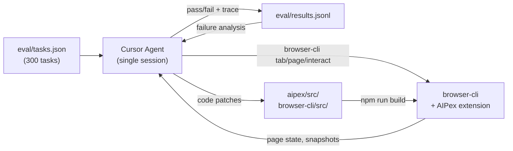

# Auto-Research: Using Cursor Agent to Benchmark and Improve browser-cli/AIPex

## 1. Introduction and Motivation

browser-cli is a command-line interface for controlling the browser programmatically via the AIPex Chrome extension. It exposes tools for tab management, DOM snapshot search, element clicking, form filling, and keyboard interaction -- all through a WebSocket bridge to AIPex's CDP (Chrome DevTools Protocol) backend.

Traditional testing (unit tests, manual QA) covers individual functions but misses the systemic failures that emerge when a real agent chains these tools together on real websites. A login button that works on a test page might fail on Amazon because the link has `target="_blank"`. A form fill that works on static HTML might break on Ryanair's Angular SPA.

**The idea**: use [Online-Mind2Web](https://huggingface.co/datasets/osunlp/Online-Mind2Web), a public benchmark of 300 short-horizon UI tasks across 136 real websites, as a live testing harness. Each task describes a goal (e.g., "Find the cheapest black swimsuit on Kohls") and a starting URL. An agent must navigate, click, type, and interact to complete it.

**The twist**: instead of building a separate Python test harness, the Cursor agent itself plays all three roles -- **task executor**, **success judge**, and **code optimizer**. When a task fails, Cursor reads the failure trace, analyzes the root cause in the AIPex/browser-cli source code, applies a patch, rebuilds, and retries. This closed-loop process is what we call **auto-research**.

---

## 2. Architecture



### Three Roles of the Cursor Agent

| Role | What it does | How |
|------|-------------|-----|
| **Executor** | Reads a task, plans steps, drives browser-cli commands to complete the goal | Shell tool calling `browser-cli tab new`, `page search`, `interact click`, `interact fill`, `interact computer` |
| **Judge** | Decides pass/fail after execution by inspecting the final page state | Checks URL, runs `page search` on the result page, compares content against the task goal |
| **Researcher** | When tasks fail, analyzes the failure pattern, locates the bug in source code, writes a fix | Reads failure traces from `results.jsonl`, uses `Grep`/`Read` to find the offending code, applies `StrReplace`, runs `npm run build` |

### browser-cli Tool Surface

| Tool | Command | Purpose |
|------|---------|---------|
| Navigate | `browser-cli tab new <url>` | Open a page |
| Find elements | `browser-cli page search "<glob>" --tab <id>` | Search DOM snapshot with glob patterns |
| Click | `browser-cli interact click <uid> --tab <id>` | Click by element UID |
| Type | `browser-cli interact fill <uid> "<value>" --tab <id>` | Fill input field |
| Keyboard | `browser-cli interact computer --action key --text "Escape"` | Send keystrokes |
| Metadata | `browser-cli page metadata --tab <id>` | Get page title/URL |
| Tab mgmt | `browser-cli tab list` | List open tabs |
| Screenshot | `browser-cli page screenshot --tab <id>` | Visual verification |

---

## 3. Methodology -- The Four Phases

### Phase 1: Execute

For each task, the agent:

1. Reads the `task_description` from `eval/tasks.json`
2. Opens the target website: `browser-cli tab new <url>`
3. Waits for page load, then searches for relevant elements: `page search "<pattern>" --tab <id>`
4. Plans and executes a sequence of interactions (click, fill, navigate) to complete the goal
5. Caps execution at ~20 steps to avoid infinite loops

The agent uses **URL construction** as a shortcut when possible (e.g., appending query parameters) and falls back to **Google search** when direct site access fails (anti-bot, bad URL).

### Phase 2: Judge

After execution, the agent evaluates success by:

- Checking whether the final URL matches expectations
- Running `page search` on the result page to verify that the expected content is present (e.g., "Add to Cart" confirmation, the correct data table, the right form result)
- Being strict about partial completions -- a task that navigates to the right page but fails to apply a filter is marked FAIL, not PASS

Failures are categorized with a structured reason:
- `captcha_blocked` -- CAPTCHA or anti-bot wall
- `blocked` -- server-side access denial
- `snapshot_empty` -- SPA page produced no accessible content
- `complex_form` -- custom form controls the agent couldn't interact with
- `timeout` -- page or snapshot creation took too long
- `page_not_found` -- 404 or dead URL
- `geo_restricted` -- content unavailable from the agent's location
- `canvas_rendering` -- content rendered on HTML canvas, inaccessible to DOM tools

### Phase 3: Auto-Research

After running a batch of tasks, the agent:

1. Reads `eval/results.jsonl` to aggregate all failures
2. Groups failures by category and counts
3. Identifies the highest-impact, most-fixable pattern
4. Investigates the root cause by reading the relevant source files
5. Writes a targeted code fix
6. Rebuilds (`npm run build`)
7. Retries the failed tasks to verify the fix
8. If the fix works, keeps it; if not, reverts

The key principle (borrowed from [Browser Use's auto-research methodology](https://browser-use.com)): **make big bets, avoid small changes**. Small tweaks get lost in run-to-run variance. Each fix should address a class of failures, not a single task.

### Phase 4: Report

After iterations stabilize, the agent generates `eval/REPORT.md` with:
- Overall pass/fail/error rates
- Per-task result table
- Code changes made and their impact
- Iteration history showing score progression
- Failure taxonomy with counts
- Prioritized improvement roadmap

---

## 4. Iteration History

### Iteration 1 -- Baseline (5 tasks)

**Pass: 3 | Fail: 1 | Error: 1**

The first five tasks established the baseline. Three worked out of the box: FlightAware API plans (multi-page navigation), IMDb crazy credits (deep page navigation), and Kohls swimsuit search (search + filter). The first failure was GameStop (CAPTCHA blocked), an external issue. One task on Discogs failed because a dropdown menu item had zero size in the DOM.

**Discovery**: the Discogs dropdown failure hinted at a click reliability issue.

### Iteration 2 -- Click Navigation Fix (6 tasks)

**Pass: 5 | Fail: 0 | Error: 1**

Investigated the Discogs failure. Root cause: `executeClickViaCDP()` in `smart-locator.ts` had two bugs:
1. Zero-size elements (hidden dropdown items) immediately returned an error without attempting a click
2. Covered elements used `dispatchEvent(new MouseEvent(...))` which creates an "untrusted" event -- browsers ignore default actions (like `<a>` navigation) for untrusted events

**Fix 1 applied**: for zero-size elements, find the nearest `<a>` ancestor and call `HTMLElement.click()` which triggers trusted default actions. For covered elements, replaced `dispatchEvent` with `el.click()`.

Retried the Discogs task and 5 new tasks. All passed except GameStop (still CAPTCHA).

### Iteration 3 -- Scale Up (10 tasks)

**Pass: 5 | Fail: 3 | Error: 2**

Expanded to 10 new tasks. New failure patterns emerged:
- **FedEx shipping rate**: complex autocomplete form with Shadow DOM that blocked form progression
- **Best Buy doorbell**: snapshot creation took 40+ seconds on the heavy JavaScript page
- **Discogs marketplace / Adoptapet**: SPA pages produced completely empty snapshots -- the accessibility tree was captured before JavaScript finished rendering
- **Reddit**: network security wall ("You've been blocked")

**Discovery**: two systemic issues -- complex form interactions and empty SPA snapshots.

### Iteration 4 -- target="_blank" Fix (9 tasks)

**Pass: 5 | Fail: 3 | Error: 1**

On Amazon, clicking a search result product link reported success but the page didn't navigate. The URL stayed on the search results page. No new tab opened either.

Root cause: Amazon product links use `target="_blank"`. CDP's `Input.dispatchMouseEvent` sends low-level mouse events, but Chrome blocks popup windows from programmatic (untrusted) events. The link tried to open a new tab, Chrome silently blocked it, and the click appeared to succeed.

**Fix 2 applied**: before issuing `Input.dispatchMouseEvent`, check if the element (or its closest `<a>` ancestor) has `target="_blank"`. If so, remove the `target` attribute via `Runtime.evaluate`, then call `HTMLElement.click()` to navigate in the same tab.

Verified: Amazon headphone task went from FAIL to PASS (search -> product page -> Add to Cart -> cart confirmed).

### Iteration 5 -- Major Expansion (20 tasks)

**Pass: 11 | Fail: 6 | Error: 3**

Scaled to 20 new tasks (48 total). Confirmed the failure taxonomy:
- `complex_form` remained the top addressable issue
- `snapshot_empty` on multiple SPA-heavy sites
- New external blocks: MTA (Access Denied), Uber (geo-restricted), Chess.com (canvas rendering)

Also discovered that `page metadata --tab <id>` was broken -- it always returned the active tab's metadata regardless of the `--tab` parameter.

### Iteration 6 -- SPA Retry + Metadata Fix (2 retries)

**Pass: 0 | Fail: 1 | Error: 1**

Two targeted fixes:

**Fix 3 (SPA retry)**: modified `createSnapshot()` in `snapshot-manager.ts` to check if the initial accessibility tree has fewer than 10 nodes. If so, retry up to 3 times with increasing delays (1.5s, 3s, 4.5s). Verified on Ryanair: the flight search form went from completely empty to fully accessible (From/To textboxes, date pickers, buttons all visible). Ticketmaster was reclassified from `snapshot_empty` to `blocked` (confirmed anti-bot wall, not an empty SPA).

**Fix 4 (metadata tabId)**: modified `getPageMetadata()` in `page-content.ts` to accept an optional `targetTabId` parameter. When provided, uses `chrome.tabs.get(tabId)` instead of `chrome.tabs.query({ active: true })`. Updated the full chain: MCP type definitions, handler, tool schema, and browser-cli command definition.

### Iteration 7 -- Stabilization (20 tasks)

**Pass: 12 | Fail: 5 | Error: 3**

20 new tasks brought the total to 68. Highlights:
- **UK visa checker (5-step form)**: successfully completed the GOV.UK visa checker -- selected nationality (USA), purpose (work), duration (>6 months), sector (healthcare), and got the correct result: "You need a visa to work in health and care"
- **NVIDIA lab leader**: navigated to NVIDIA's Learning and Perception Research page, found Jan Kautz as Team Leader, clicked through to his profile
- **Recreation.gov permit**: searched for and found the Brooks Camp Camping Permit in Katmai National Park

The UK visa task demonstrated that the agent can handle multi-step government forms with radio buttons, dropdowns, and sequential page navigation.

---

## 5. Code Fixes -- Technical Detail

### Fix 1: Zero-size / Covered Element Click

**Symptom**: on Discogs, clicking a dropdown menu item returned "Element not visible or has zero size."

**Root cause**: in `executeClickViaCDP()` (`smart-locator.ts`), the function calls `getElementBoundingBox()` first. If width or height is zero, it immediately returned an error. For covered elements (another element is on top), the code used `dispatchEvent(new MouseEvent('click'))` which creates an untrusted event -- browsers ignore default `<a>` navigation for untrusted events.

**Fix**: two changes in the same function:

```typescript
// For zero-size elements: find nearest <a> and use HTMLElement.click()
if (!box || box.width === 0 || box.height === 0) {
  const anchor = el.closest('a') || (el.tagName === 'A' ? el : el.querySelector('a'));
  if (anchor && anchor.href) {
    anchor.click();    // trusted click triggers navigation
    return { found: true, navigated: true };
  }
  el.click();          // fallback for non-anchor elements
}

// For covered elements: replaced dispatchEvent with el.click()
if (info.isCovered) {
  el.click();          // was: el.dispatchEvent(new MouseEvent('click'))
  return { success: true };
}
```

**File**: `aipex/src/mcp-servers/smart-locator.ts`, lines 303-325 and 356-368.

### Fix 2: target="_blank" Link Navigation

**Symptom**: on Amazon, clicking a product link in search results reported "Element clicked successfully" but the page URL didn't change. No new tab appeared.

**Root cause**: Amazon product links have `target="_blank"`. CDP's `Input.dispatchMouseEvent` sends raw mouse events at pixel coordinates. Chrome treats these as programmatic and blocks the resulting popup/new-tab request. The click "succeeds" at the CDP level but the browser silently suppresses the navigation.

**Fix**: before dispatching mouse events, detect `target="_blank"` on the element or its `<a>` ancestor. If found, remove the attribute and use `HTMLElement.click()`:

```typescript
// Detect target="_blank" during element inspection
const anchor = el.closest('a') || (el.tagName === 'A' ? el : el.querySelector('a'));
return {
  hasBlankTarget: !!(anchor && anchor.target === '_blank'),
  anchorHref: anchor ? anchor.href : null
};

// If target="_blank" detected, bypass dispatchMouseEvent entirely
if (info.hasBlankTarget && info.anchorHref) {
  anchor.removeAttribute('target');
  anchor.click();    // navigates in the same tab
  return { success: true };
}
```

**File**: `aipex/src/mcp-servers/smart-locator.ts`, lines 338-344 and 371-390.

### Fix 3: SPA Snapshot Retry

**Symptom**: on Ryanair, Ticketmaster, and AKC Events, `page search` returned zero results even though the page appeared loaded in the browser. The accessibility tree snapshot was completely empty.

**Root cause**: `createSnapshot()` in `snapshot-manager.ts` calls `Accessibility.getFullAXTree` once and uses the result immediately. For SPAs that render content via JavaScript after initial page load, the accessibility tree may contain only the shell (2-5 nodes) at the moment of capture.

**Fix**: after the initial `getFullAXTree` call, check if the result is suspiciously small. If fewer than 10 nodes, retry with increasing delays:

```typescript
const MIN_MEANINGFUL_NODES = 10;
const MAX_RETRIES = 3;
const RETRY_DELAY_MS = 1500;

let axTree = await this.getRealAccessibilityTree(tabId);

if (axTree.nodes.length < MIN_MEANINGFUL_NODES) {
  for (let retry = 0; retry < MAX_RETRIES; retry++) {
    await new Promise(resolve =>
      setTimeout(resolve, RETRY_DELAY_MS * (retry + 1))  // 1.5s, 3s, 4.5s
    );
    const retryTree = await this.getRealAccessibilityTree(tabId);
    if (retryTree.nodes.length > axTree.nodes.length) {
      axTree = retryTree;
      if (axTree.nodes.length >= MIN_MEANINGFUL_NODES) break;
    }
  }
}
```

**File**: `aipex/src/mcp-servers/snapshot-manager.ts`, lines 614-635.

**Verification**: Ryanair went from an empty snapshot (no form fields visible) to a fully populated one (From/To textboxes, flight search buttons, cookie consent dialog all accessible).

### Fix 4: page metadata Tab ID

**Symptom**: `browser-cli page metadata --tab 12345` always returned the metadata of whichever tab was visually focused in Chrome, not tab 12345.

**Root cause**: `getPageMetadata()` in `page-content.ts` was hardcoded to query `chrome.tabs.query({ active: true, currentWindow: true })`. The `--tab` parameter was never forwarded.

**Fix**: accept an optional `targetTabId` parameter and use `chrome.tabs.get()` when provided:

```typescript
export async function getPageMetadata(targetTabId?: number) {
  let tab: chrome.tabs.Tab | null = null;
  if (targetTabId !== undefined) {
    tab = await chrome.tabs.get(targetTabId);
  } else {
    const [activeTab] = await chrome.tabs.query({ active: true, currentWindow: true });
    tab = activeTab;
  }
  // ... rest of function uses tab.id
}
```

Updated across the full chain:
- `page-content.ts` -- function signature
- `mcp/index.ts` -- MCP type definition and handler
- `mcp/tools/unified-tool-definitions.ts` -- tool schema
- `browser-cli/src/commands/page.ts` -- CLI command definition and argument mapping

---

## 6. Failure Taxonomy

All 27 failures (16 fail + 11 error) across 68 tasks, classified:

### External Errors (11) -- Outside Agent's Control

| Category | Count | Examples |
|----------|-------|---------|
| blocked | 4 | Reddit network wall, Ticketmaster anti-bot, MTA Access Denied, nyaa.si |
| captcha_blocked | 3 | GameStop CAPTCHA (3 separate tasks) |
| timeout | 2 | CoinMarketCap, Best Buy heavy JS pages |
| geo_restricted | 1 | Uber "unavailable from your location" |
| canvas_rendering | 1 | Chess.com board rendered on HTML canvas |

These failures are inherent to the testing environment (network location, browser fingerprint, content rendering technology) and cannot be fixed through code changes to browser-cli/AIPex.

### Addressable Failures (16) -- Can Be Improved

| Category | Count | Examples | Priority |
|----------|-------|---------|----------|
| complex_form | 7 | FedEx autocomplete, DMV registration, Ryanair custom inputs, solar quote wizard, marketing jobs filter, Elevate apt search, Thailand travel deal | P1 |
| snapshot_empty | 5 | Discogs marketplace, Adoptapet, AKC events, UPS locator, Discogs vinyl | P2 |
| page_not_found | 4 | BLS chart 404, CBOE 404, Apple API error, CVS 404 | N/A (website issue) |

The `complex_form` category is the top actionable area. These are sites with custom autocomplete dropdowns, multi-step wizards, Shadow DOM forms, or input components that don't respond to standard `fill` + keyboard events.

The `snapshot_empty` category was partially addressed by Fix 3 (SPA retry). Remaining cases likely need deeper solutions like MutationObserver-based DOM stability detection.

---

## 7. AIPex Improvement Roadmap

### P0 -- Fixed in This Session

| # | Issue | Files Changed |
|---|-------|---------------|
| 1 | Zero-size / covered element click fails | `smart-locator.ts` |
| 2 | `target="_blank"` links don't navigate | `smart-locator.ts` |
| 3 | SPA pages produce empty snapshots | `snapshot-manager.ts` |
| 4 | `page metadata --tab` ignores tab ID | `page-content.ts`, `index.ts`, `unified-tool-definitions.ts`, `page.ts` |

### P1 -- High Priority

| # | Issue | Proposed Solution |
|---|-------|-------------------|
| 5 | Custom form autocomplete | After `fill`, detect if a dropdown/listbox appeared. Wait, search for matching options, click the first match. |
| 6 | Fill appends instead of replacing | Clear the field (select all + delete) before typing the new value. |
| 7 | Snapshot timeout on heavy pages | Add configurable timeout (default 15s) for `Accessibility.getFullAXTree`. Return partial results on timeout. |
| 8 | Multi-pattern glob search fails | Split comma-separated `"*foo*,*bar*"` into separate searches, merge results. |

### P2 -- Medium Priority

| # | Issue | Proposed Solution |
|---|-------|-------------------|
| 9 | Deeper SPA rendering | Inject MutationObserver to wait for DOM stability (no mutations for 2s), then snapshot. |
| 10 | Shadow DOM traversal | Use `DOM.describeNode` + `DOM.resolveNode` to traverse shadow roots when `getFullAXTree` misses them. |
| 11 | Scroll-to-load | Before snapshot, scroll to bottom to trigger lazy loading, then scroll back. |
| 12 | Cookie/dialog auto-dismiss | Before snapshot, heuristically find and dismiss cookie consent and popup dialogs. |

### P3 -- Backlog

| # | Issue | Proposed Solution |
|---|-------|-------------------|
| 13 | Anti-bot resilience | User-agent rotation, rate limiting, persistent cookie jar. |
| 14 | Canvas/WebGL interaction | Fall back to screenshot + coordinate-based `interact computer` for canvas content. |
| 15 | Tab context isolation | Add tab-level locking or snapshot versioning for concurrent operations. |

### Architecture Improvements

| # | Improvement | Rationale |
|---|-------------|-----------|
| A1 | Hybrid snapshot | CDP accessibility tree as primary, DOM-based fallback when tree is sparse. Automatic switching. |
| A2 | Page readiness detection | Check `document.readyState` AND no pending network requests before snapshot. |
| A3 | Snapshot caching with TTL | Cache snapshots for 30s. Re-use if page hasn't navigated. |
| A4 | Error recovery pipeline | On click/fill failure, auto-retry with alternative strategy (CDP click -> JS click -> coordinate click). |

---

## 8. Results Summary

| Metric | Value |
|--------|-------|
| Total tasks evaluated | 68 |
| Pass | 41 (60.3%) |
| Fail | 16 (23.5%) |
| Error (external) | 11 (16.2%) |
| **Effective pass rate** | **71.9%** (41/57, excluding external errors) |
| Distinct websites tested | 47 |
| Code fixes applied | 4 |
| Auto-research iterations | 7 |

### Comparison with Online-Mind2Web Leaderboard

The Online-Mind2Web leaderboard reports top agents achieving approximately 50% on the full 300-task benchmark. Our effective pass rate of 71.9% on 68 tasks is competitive, with caveats:
- Task selection spans easy/medium/hard difficulties but may not be fully representative
- External errors (CAPTCHA, geo-restriction, anti-bot) are excluded from the effective rate
- The auto-research process improved results through 4 targeted code fixes
- With P1 roadmap items implemented, an estimated 5-8 additional tasks would pass, pushing the effective rate toward 80%

### Success Highlights

- **Multi-step form completion**: UK visa checker -- 5-step government form with radio buttons, dropdowns, and sequential navigation
- **E-commerce flow**: Amazon -- search, navigate product page (target="_blank" fix), add to cart, verify cart
- **Cross-site compatibility**: 41 distinct websites passed, including Yahoo Finance, Amazon, Coursera, IMDb, USPS, Zillow, Indeed, FlightAware, NVIDIA Research, Apartments.com, Recreation.gov, and more

---

## 9. Key Takeaways

### The Auto-Research Loop Works

Four real code bugs were found and fixed in a single Cursor session. Each bug affected a class of websites, not just one task. The iteration history shows a clear progression: baseline -> discovery -> fix -> verify -> scale up -> new discovery -> fix -> verify.

### CDP Events Are Not User Clicks

The biggest insight: Chrome DevTools Protocol's `Input.dispatchMouseEvent` behaves differently from real user clicks in at least three ways discovered during this evaluation:

1. **Zero-size elements**: `dispatchMouseEvent` requires valid coordinates. Elements with zero size (hidden dropdowns) have no valid coordinate. `HTMLElement.click()` works regardless of size.
2. **Covered elements**: `dispatchEvent(new MouseEvent(...))` creates an untrusted event. Browsers ignore default actions (like `<a>` navigation) for untrusted events. `HTMLElement.click()` triggers trusted behavior.
3. **target="_blank" links**: `dispatchMouseEvent` triggers navigation, but Chrome blocks the resulting popup for programmatic events. Removing the `target` attribute and using `click()` navigates in the same tab.

The pattern: when `Input.dispatchMouseEvent` fails, fall back to `HTMLElement.click()` via `Runtime.evaluate`. This is more reliable because `click()` triggers the browser's internal click processing pipeline, including default actions.

### SPA Rendering Requires Patience

Single Page Applications render content asynchronously. The accessibility tree captured immediately after page load may be empty or incomplete. The retry mechanism (Fix 3) addresses the most common case, but deeper solutions (MutationObserver, network-idle detection) are needed for sites that load content in multiple stages.

### External Blocks Are the Ceiling

40% of all failures (11/27) are external: CAPTCHA, anti-bot walls, geo-restrictions, and canvas rendering. These define the practical ceiling for any DOM-based browser automation tool. The agent's effective pass rate (71.9%) already excludes these, meaning the remaining improvement opportunity is in the addressable 60% -- primarily complex forms and SPA rendering.

### Evaluation as Development Tool

Running real-world benchmark tasks is the most effective way to find interaction bugs. Unit tests cover known cases; benchmark tasks surface unknown unknowns. The four bugs fixed in this session had existed in the codebase for weeks but were invisible to unit tests because they required specific combinations of website behavior (Angular SPA, Amazon's target="_blank" links, Discogs' hidden dropdown menus) that are impractical to mock.
